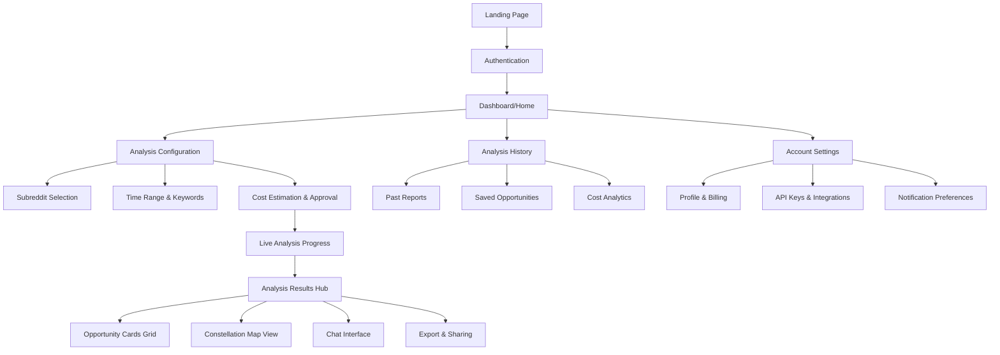
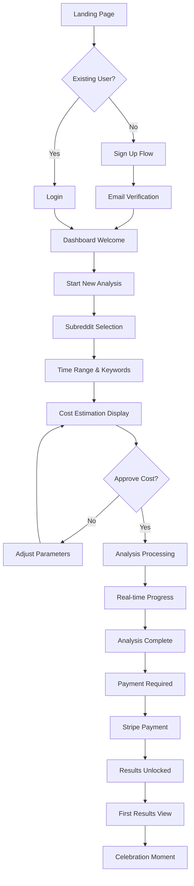
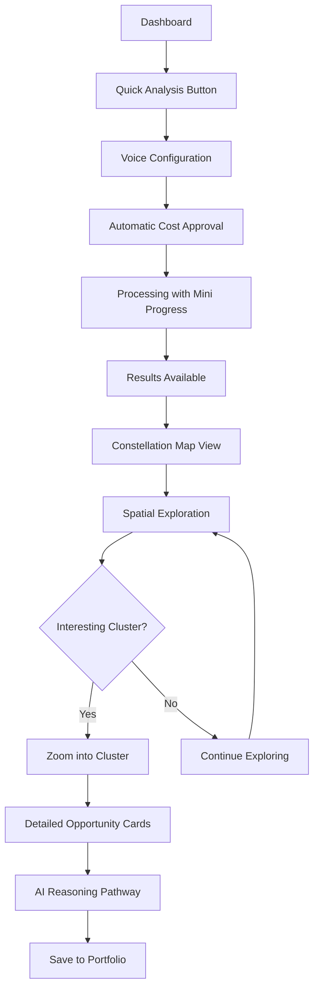
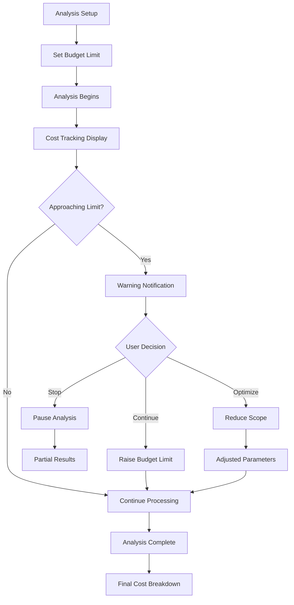

# SaaS Opportunity Intelligence Tool UI/UX Specification

*Generated: 2025-08-07*
*Based on comprehensive PRD and creative UX exploration*

This document defines the user experience goals, information architecture, user flows, and visual design specifications for the SaaS Opportunity Intelligence Tool's user interface. It serves as the foundation for visual design and frontend development, ensuring a cohesive and user-centered experience.

---

## Overall UX Goals & Principles

### Target User Personas

**Primary Persona: Technical Indie Hackers**
- Profile: Developers with 3-10 years experience seeking profitable side projects
- Behavior: Budget-conscious, appreciate transparency, value data-driven decisions
- Goals: Find 1-3 validated SaaS ideas worth pursuing while avoiding common pitfalls
- Pain Points: Fear of wasting months on unvalidated ideas, analysis paralysis from too many options

**Secondary Persona: "Vibe Coders"**
- Profile: Junior developers (1-5 years) exploring entrepreneurship casually
- Behavior: Trend-following, need confidence building, prefer simple approaches
- Goals: Learn market validation basics while finding approachable project ideas
- Pain Points: Overwhelmed by complex analysis, need external validation for ideas

### Enhanced Usability Goals

**Core Usability Goals:**
- **Cost Transparency:** Users understand exactly what they'll pay before starting analysis and can track costs in real-time with crystalline clarity
- **Trust Building:** Professional interface creates confidence in AI-generated recommendations through transparent reasoning pathways
- **Spatial Navigation:** Users can explore opportunity landscapes intuitively, making complex data spatially comprehensible
- **Efficiency:** Power users can configure and launch analyses in under 2 minutes using voice-driven configuration
- **Discovery Delight:** Analysis process includes celebration micro-moments and engaging visual feedback

**Advanced Experience Goals:**
- **Collaborative Intelligence:** Multiple users can simultaneously explore analyses with real-time collaboration features
- **Empathetic Connection:** Interface reminds users of human stories behind data points through empathy mode
- **Progressive Mastery:** Users develop expertise through recipe sharing and community knowledge patterns

### Enhanced Design Principles

1. **Transparency Above All** - Every cost, AI decision, and data source must be visible through interactive reasoning pathways
2. **Spatial Intelligence** - Transform overwhelming data into explorable, three-dimensional experience spaces
3. **Cost-Conscious Elegance** - Pricing information presented as beautiful, interactive elements rather than intimidating numbers
4. **Professional Credibility** - Visual design conveys sophisticated analysis capabilities while remaining approachable
5. **Dark Mode Native** - Designed for developers who prefer dark interfaces, with dot grid patterns as signature element
6. **Celebration-Driven** - Progress acknowledgment and discovery moments create positive reinforcement cycles
7. **Voice-First Interaction** - Natural language configuration removes friction from complex analysis setup

### Innovation Integration Strategy

**Phase 1 Innovations (MVP):**
- Cost crystallization animations for transparent pricing
- Progress celebration micro-moments
- Voice-driven analysis configuration

**Phase 2 Innovations (Enhanced):**
- AI reasoning pathway visualization
- Opportunity constellation map exploration
- Empathy mode for human context

**Phase 3 Innovations (Advanced):**
- Collaborative workspace features
- Analysis recipe sharing community
- Temporal analysis capabilities

### Change Log

| Date | Version | Description | Author |
|------|---------|-------------|--------|
| 2025-08-07 | 1.0 | Initial UI/UX specification with creative feature integration | Sally (UX Expert) |

---

## Information Architecture (IA)

### Site Map / Screen Inventory



### Navigation Structure

**Primary Navigation:** Fixed sidebar with main sections (Dashboard, New Analysis, History, Account) - always visible for spatial orientation and quick access to core functions

**Secondary Navigation:** Contextual tabs within each section enabling view switching:
- Results Hub: Grid View, Constellation Map, Chat Interface
- History: Timeline View, Cost Analytics, Saved Items
- Configuration: Basic Setup, Advanced Filters, Voice Mode

**Breadcrumb Strategy:** Smart breadcrumbs showing analysis flow progression with integrated cost accumulation display - users can see both their location and spending in one visual element

---

## User Flows

### Flow 1: First-Time Analysis Creation

**User Goal:** Complete first analysis from signup to results with confidence and cost control

**Entry Points:** Landing page, referral links, direct signup

**Success Criteria:** User completes payment and accesses analysis results, understands cost structure, feels confident in tool value

#### Flow Diagram



#### Edge Cases & Error Handling:
- Reddit API failure during analysis → Partial results with cost adjustment
- Payment failure → Results held with retry options and support contact
- Analysis timeout → Automatic pause with user notification and continuation options
- Invalid subreddit selection → Real-time validation with suggestions
- Cost estimation significantly wrong → Refund policy explanation and adjustment

**Notes:** Voice Integration available at subreddit selection. Cost Crystallization displays animated cost crystals for breakdowns. First successful analysis triggers special "first discovery" celebration animation.

### Flow 2: Power User Analysis with Constellation Map

**User Goal:** Quickly configure analysis and explore results using advanced spatial visualization

**Entry Points:** Dashboard, direct analysis link, saved analysis template

**Success Criteria:** Efficient analysis setup, meaningful pattern discovery through map exploration, actionable insights identified

#### Flow Diagram



#### Edge Cases & Error Handling:
- Voice recognition failure → Fallback to traditional form with parsed parameters displayed
- Map rendering issues → Automatic fallback to grid view with explanation
- Large dataset performance → Progressive loading with spatial prioritization
- Cluster analysis failure → Show individual opportunities with clustering unavailable notice

**Notes:** Showcases constellation map, voice configuration, and AI reasoning pathways. Map view loads progressively for smooth interaction. System learns user exploration patterns.

### Flow 3: Cost-Conscious Budget Management

**User Goal:** Control analysis spending while getting maximum value

**Entry Points:** Cost estimation screen, analysis in progress, billing settings

**Success Criteria:** User stays within budget, understands value received, feels confident about cost-benefit ratio

#### Flow Diagram



#### Edge Cases & Error Handling:
- Sudden cost spike → Immediate pause with explanation and options
- Estimation wildly inaccurate → Automatic adjustment with user notification
- Payment method failure → Analysis paused with multiple payment options
- Budget exceeded → Automatic stop with partial results and explanation

**Notes:** Every cost decision point shows crystal-clear breakdown. Multiple intervention points for spending control. Results show cost-per-insight metrics.

---

## Wireframes & Mockups

### Design Files

**Primary Design Files:** Figma workspace with organized structure:
- Design System & Components Library
- User Flow Prototypes with Interactive Elements
- Screen Wireframes & High-Fidelity Mockups
- Innovation Feature Prototypes (constellation map, voice UI, cost crystallization)
- Developer Handoff Specifications

### Key Screen Layouts

#### Analysis Configuration Page

**Purpose:** Enable users to set up their Reddit analysis with cost transparency and optional voice input

**Key Elements:**
- Subreddit selection with autocomplete and validation
- Time range selector (30/60/90 days) with visual calendar
- Keyword customization with pre-built pain point categories
- Cost crystallization display showing estimated breakdown with interactive crystals
- Voice activation button with waveform visualization during input
- Progress stepper showing configuration completion
- Prominent "Start Analysis" button with cost approval modal

**Interaction Notes:** Voice mode transforms the entire interface - form fields highlight as voice input is parsed. Cost crystals can be tapped/clicked to reveal detailed breakdowns. Real-time cost updates as parameters change.

**Design File Reference:** Figma Frame: Analysis-Configuration-Main

#### Live Analysis Progress Dashboard

**Purpose:** Show real-time analysis progress with cost tracking and user control options

**Key Elements:**
- Central progress visualization with stages (Reddit Collection, AI Processing, Vectorization)
- Real-time cost accumulation with crystalline growth animation
- Current processing stage indicator with estimated time remaining
- Live data preview showing sample opportunities being discovered
- Pause/modify analysis controls with cost impact preview
- Celebration micro-moments when milestones are reached

**Interaction Notes:** Progress bar fills with different colors representing different cost types. Users can hover over any stage to see detailed breakdown. Pause button shows estimated savings if stopped early.

**Design File Reference:** Figma Frame: Live-Progress-Dashboard

#### Results Hub with Constellation Map

**Purpose:** Present analysis results through both traditional grid and innovative spatial visualization

**Key Elements:**
- View switcher: Grid View, Constellation Map View, Chat Interface
- 3D constellation map with opportunities as connected nodes
- Zoom and pan controls with minimap for orientation
- Opportunity detail panel that slides in when nodes are selected
- AI reasoning pathway visualization showing decision trails
- Filter controls that work across all view modes
- Export and sharing options

**Interaction Notes:** Constellation map supports mouse/touch navigation with smooth zoom. Node size represents market potential, color indicates competition. Connection lines show semantic relationships. Users can "fly through" the space using WASD keys or touch gestures.

**Design File Reference:** Figma Frame: Results-Constellation-Hub

#### Opportunity Detail Card with AI Reasoning

**Purpose:** Show comprehensive opportunity analysis with transparent AI decision-making

**Key Elements:**
- Opportunity title with confidence score visualization
- Market signals section with supporting quotes from Reddit
- AI reasoning pathway showing step-by-step analysis logic
- Anti-pattern warnings with clear explanations
- Implementation complexity assessment
- Cost breakdown for this specific opportunity's analysis
- Save to portfolio and sharing controls

**Interaction Notes:** Reasoning pathway can be expanded/collapsed by section. Users can follow the AI's "thought process" through interactive decision tree. Hover states reveal additional context and data sources.

**Design File Reference:** Figma Frame: Opportunity-Detail-Expanded

#### Voice Configuration Interface

**Purpose:** Provide intuitive voice-driven analysis setup with visual feedback

**Key Elements:**
- Large microphone activation button with pulsing animation
- Real-time speech visualization with waveform display
- Parsed parameters displayed as they're recognized
- Confidence indicators for each recognized element
- Correction interface for misunderstood inputs
- Cost estimation updates in real-time as voice input is processed
- Fallback to traditional forms if voice fails

**Interaction Notes:** Interface "breathes" during listening mode. Visual feedback shows which parameters are being captured. Users can tap any parsed element to correct it manually. Voice recognition errors trigger gentle correction prompts.

**Design File Reference:** Figma Frame: Voice-Configuration-Active

---

## Branding & Style Guide

### Visual Identity

**Brand Guidelines:** The SaaS Opportunity Intelligence Tool follows the "Transparent Intelligence Design" philosophy, combining sophisticated fintech aesthetics (Mercury.com inspiration) with developer-focused functionality. The visual identity communicates trustworthiness, analytical precision, and modern technical capability while remaining approachable for indie hackers and technical entrepreneurs.

**Core Brand Attributes:**
- **Intelligent:** Every visual element suggests analytical depth and AI-powered insights
- **Transparent:** Clear hierarchy and information architecture make complex data accessible
- **Professional:** Sophisticated color palette and typography convey credibility and reliability  
- **Developer-Centric:** Dark mode default and technical aesthetic appeal to primary user base
- **Cost-Conscious:** Visual design reinforces value transparency and spending control

### Color Palette

| Color Type | Hex Code | RGB | Usage |
|------------|----------|-----|-------|
| **Primary** | #2563eb | 37, 99, 235 | Primary CTAs, key interactive elements, brand accent |
| **Primary Dark** | #1d4ed8 | 29, 78, 216 | Primary hover states, active elements |
| **Secondary** | #7c3aed | 124, 58, 237 | Secondary actions, opportunity scoring highlights |
| **Secondary Dark** | #6d28d9 | 109, 40, 217 | Secondary hover states, constellation connections |
| **Success** | #10b981 | 16, 185, 129 | Positive feedback, confirmations, profitable opportunities |
| **Warning** | #f59e0b | 245, 158, 11 | Cautions, important notices, cost warnings |
| **Error** | #ef4444 | 239, 68, 68 | Errors, destructive actions, anti-pattern flags |
| **Cost Crystal** | #06b6d4 | 6, 182, 212 | Cost visualization, crystal animations, pricing elements |
| **Opportunity High** | #22c55e | 34, 197, 94 | High-scoring opportunities (80+) |
| **Opportunity Mid** | #eab308 | 234, 179, 8 | Medium-scoring opportunities (60-79) |
| **Opportunity Low** | #6b7280 | 107, 114, 128 | Lower opportunities, filtered results |

**Dark Mode Colors (Default):**
| Element | Hex Code | RGB | Usage |
|---------|----------|-----|-------|
| **Background Primary** | #0f172a | 15, 23, 42 | Main background, dot grid base |
| **Background Secondary** | #1e293b | 30, 41, 59 | Card backgrounds, elevated surfaces |
| **Background Tertiary** | #334155 | 51, 65, 85 | Input fields, secondary surfaces |
| **Text Primary** | #f8fafc | 248, 250, 252 | Headings, primary content |
| **Text Secondary** | #cbd5e1 | 203, 213, 225 | Body text, descriptions |
| **Text Tertiary** | #64748b | 100, 116, 139 | Muted text, metadata |
| **Border** | #475569 | 71, 85, 105 | Card borders, dividers |
| **Border Subtle** | #334155 | 51, 65, 85 | Subtle separators, grid lines |
| **Dot Grid** | #1e293b | 30, 41, 59 | Dot pattern overlay (15% opacity) |

**Light Mode Colors (Alternative):**
| Element | Hex Code | RGB | Usage |
|---------|----------|-----|-------|
| **Background Primary** | #ffffff | 255, 255, 255 | Main background, clean base |
| **Background Secondary** | #f8fafc | 248, 250, 252 | Card backgrounds, elevated surfaces |
| **Background Tertiary** | #f1f5f9 | 241, 245, 249 | Input fields, secondary surfaces |
| **Text Primary** | #0f172a | 15, 23, 42 | Headings, primary content |
| **Text Secondary** | #334155 | 51, 65, 85 | Body text, descriptions |
| **Text Tertiary** | #64748b | 100, 116, 139 | Muted text, metadata |
| **Border** | #e2e8f0 | 226, 232, 240 | Card borders, dividers |
| **Border Subtle** | #f1f5f9 | 241, 245, 249 | Subtle separators |
| **Dot Grid** | #e2e8f0 | 226, 232, 240 | Dot pattern overlay (8% opacity) |

### Typography

#### Font Families

- **Primary (Interface):** Inter, system-ui, sans-serif - Clean, highly legible typeface optimized for UI elements and data display
- **Secondary (Headings):** Inter, system-ui, sans-serif - Same family maintains consistency while allowing weight variation
- **Monospace (Code/Data):** 'Fira Code', 'SF Mono', Consolas, monospace - Technical elements, API responses, code snippets

#### Type Scale

| Element | Size | Weight | Line Height | Letter Spacing |
|---------|------|---------|-------------|----------------|
| **Display (Hero)** | 48px (3rem) | 700 (Bold) | 1.1 | -0.025em |
| **H1** | 36px (2.25rem) | 600 (Semibold) | 1.2 | -0.020em |
| **H2** | 30px (1.875rem) | 600 (Semibold) | 1.3 | -0.015em |
| **H3** | 24px (1.5rem) | 500 (Medium) | 1.4 | -0.010em |
| **H4** | 20px (1.25rem) | 500 (Medium) | 1.4 | 0 |
| **Body Large** | 18px (1.125rem) | 400 (Regular) | 1.6 | 0 |
| **Body** | 16px (1rem) | 400 (Regular) | 1.6 | 0 |
| **Body Small** | 14px (0.875rem) | 400 (Regular) | 1.5 | 0.005em |
| **Caption** | 12px (0.75rem) | 500 (Medium) | 1.4 | 0.025em |
| **Label** | 12px (0.75rem) | 600 (Semibold) | 1.2 | 0.05em |

**Typography Usage Guidelines:**
- **Display:** Landing page hero, major section headers
- **H1:** Page titles, analysis report titles
- **H2:** Major section headings, opportunity categories
- **H3:** Subsection headings, opportunity card titles
- **H4:** Component headings, form section titles
- **Body Large:** Important descriptions, key insights
- **Body:** Standard content, opportunity descriptions
- **Body Small:** Supporting text, metadata
- **Caption:** Fine print, timestamps, disclaimers
- **Label:** Form labels, button text, navigation

### Iconography

**Icon Library:** Heroicons v2 (Outline and Solid variants)
- Consistent 24px default size with 16px and 32px variants
- Stroke width: 1.5px for outline icons
- Usage: Outline for inactive states, solid for active/selected states

**Custom Icons Required:**
- Cost Crystal: Geometric diamond shape for pricing visualization
- Constellation Node: Circle with connection points for map visualization  
- AI Brain: Stylized neural network for AI reasoning indicators
- Voice Waveform: Dynamic audio visualization for voice interface
- Reddit Alien: Simplified version for data source indicators

**Usage Guidelines:**
- Icons always paired with labels for accessibility
- Consistent color usage: primary for interactive, secondary for informational
- Hover states use appropriate color transitions (0.2s ease)
- Loading states use subtle animation (rotate for processing, pulse for waiting)

### Spacing & Layout

**Grid System:** 8px base unit system with consistent spacing rhythm
- **Base Unit:** 8px
- **Small Spacing:** 4px (0.5 × base)
- **Medium Spacing:** 16px (2 × base) 
- **Large Spacing:** 24px (3 × base)
- **Extra Large Spacing:** 32px (4 × base)
- **Section Spacing:** 48px (6 × base)
- **Page Spacing:** 64px (8 × base)

**Layout Containers:**
- **Max Width:** 1280px (80rem)
- **Content Width:** 1024px (64rem) for reading content
- **Sidebar Width:** 320px (20rem) for navigation panels
- **Card Padding:** 24px (3 × base unit)
- **Form Padding:** 16px (2 × base unit)

**Component Spacing:**
- **Button Padding:** 12px 20px (1.5 × base, 2.5 × base)
- **Input Padding:** 12px 16px (1.5 × base, 2 × base)
- **Card Gap:** 16px (2 × base unit)
- **Stack Gap:** 8px (1 × base unit) for related elements

**Dot Grid Pattern Specifications:**
- **Dot Size:** 1px diameter
- **Grid Spacing:** 24px (3 × base unit)
- **Opacity:** 15% in dark mode, 8% in light mode
- **Color:** Uses border color from theme palette
- **Pattern:** CSS background with radial-gradient dots
- **Usage:** Subtle texture on main backgrounds, not on cards or elevated surfaces

### Visual Effects & Shadows

**Shadow System:**
- **Subtle:** `0 1px 2px rgba(0, 0, 0, 0.05)` - Input fields, subtle elevation
- **Small:** `0 1px 3px rgba(0, 0, 0, 0.1), 0 1px 2px rgba(0, 0, 0, 0.06)` - Cards, buttons
- **Medium:** `0 4px 6px rgba(0, 0, 0, 0.07), 0 2px 4px rgba(0, 0, 0, 0.06)` - Modals, dropdowns
- **Large:** `0 10px 15px rgba(0, 0, 0, 0.1), 0 4px 6px rgba(0, 0, 0, 0.05)` - Major overlays
- **Extra Large:** `0 20px 25px rgba(0, 0, 0, 0.1), 0 8px 10px rgba(0, 0, 0, 0.04)` - Major modals

**Dark Mode Shadow Adjustments:**
- Increase opacity by 50% for better visibility against dark backgrounds
- Add subtle colored glows for interactive elements using primary colors at 10% opacity

**Border Radius System:**
- **Small:** 4px - Input fields, small buttons
- **Medium:** 8px - Cards, standard buttons
- **Large:** 12px - Major containers, modals
- **Extra Large:** 16px - Hero sections, major panels
- **Round:** 50% - Avatars, circular buttons, dots

---

## Accessibility Requirements

### Compliance Target

**Standard:** WCAG 2.1 AA compliance with enhanced focus on dark mode accessibility patterns and developer tool usability standards

**Rationale:** Our primary user base consists of technical professionals who rely on keyboard navigation, screen readers, and accessibility tools for productivity. Meeting AA standards ensures the application is usable by developers with disabilities while supporting assistive technologies commonly used in development environments.

**Certification Approach:** Third-party accessibility audit after MVP completion, with ongoing automated testing integrated into CI/CD pipeline using axe-core and manual testing protocols.

### Key Requirements

**Visual:**
- **Color Contrast Ratios:** Minimum 4.5:1 for normal text, 3:1 for large text (18px+) in both dark and light modes, with enhanced contrast validation for dark mode interface elements
- **Focus Indicators:** 2px solid focus ring using primary color (#2563eb) with 2px offset, clearly visible against both dark (#0f172a) and light (#ffffff) backgrounds
- **Text Sizing:** All text scalable to 200% without horizontal scrolling, with rem-based units ensuring consistent scaling across components

**Interaction:**
- **Keyboard Navigation:** Complete keyboard accessibility with logical tab order, visible focus indicators, and escape key functionality for modals and overlays
- **Screen Reader Support:** Comprehensive ARIA labels, landmark regions, and live regions for dynamic content updates (analysis progress, cost tracking, real-time results)
- **Touch Targets:** Minimum 44px × 44px touch targets for all interactive elements, with adequate spacing (8px minimum) between adjacent targets

**Content:**
- **Alternative Text:** Descriptive alt text for all informational images, decorative elements marked with empty alt attributes, complex data visualizations with text alternatives
- **Heading Structure:** Logical heading hierarchy (H1 → H2 → H3) with no skipped levels, supporting screen reader navigation and document outline
- **Form Labels:** Explicit labels for all form inputs using `<label>` elements or `aria-labelledby`, with error messages clearly associated using `aria-describedby`

### Enhanced Accessibility Features

**Developer-Specific Enhancements:**
- **Code Block Accessibility:** Syntax highlighting with sufficient contrast ratios, keyboard navigation within code blocks, and screen reader friendly code structure
- **Data Table Support:** Complex data tables with proper headers, scope attributes, and caption elements for opportunity analysis results
- **Voice Interface Accessibility:** Voice commands with visual feedback and alternative keyboard shortcuts for all voice-activated features
- **High Contrast Mode Support:** Windows/macOS high contrast mode compatibility with forced colors support
- **Reduced Motion Support:** Respect for `prefers-reduced-motion` media query, with option to disable animations in constellation map and cost crystallization

**Dynamic Content Accessibility:**
- **Live Regions:** `aria-live` announcements for analysis progress updates, cost changes, and new opportunity discoveries
- **Progress Indicators:** Accessible progress bars with percentage announcements and estimated completion times
- **Error Handling:** Clear error messages with suggestions for resolution, positioned immediately after form fields
- **Loading States:** Screen reader announcements for loading states with contextual information about what's being processed

### Specific Component Requirements

**Analysis Configuration Interface:**
- Autocomplete subreddit selection with keyboard navigation and screen reader support
- Cost estimation slider with arrow key navigation and value announcements
- Voice activation button with clear state indicators and fallback text instructions

**Results Visualization:**
- **Constellation Map:** Alternative text-based view for spatial data, keyboard navigation between nodes, and detailed descriptions of opportunity relationships
- **Opportunity Cards:** Structured data with proper heading hierarchy, expandable sections with `aria-expanded` states
- **Filter Controls:** Multi-select filters with clear selection states and count announcements

**Interactive Elements:**
- **Modals:** Proper focus management with focus trap, ESC key to close, and return focus to trigger element
- **Tooltips:** Hover and focus activated with ESC key dismissal and screen reader friendly content
- **Tabs:** Arrow key navigation between tabs with home/end key support for first/last tab navigation

### Testing Strategy

**Automated Testing:**
- **CI/CD Integration:** axe-core accessibility tests run on every pull request with minimum 95% pass rate required
- **Color Contrast Testing:** Automated contrast ratio testing for both dark and light themes using Stark or similar tools
- **Keyboard Testing:** Automated tab order testing and focus management validation

**Manual Testing Protocol:**
- **Screen Reader Testing:** Weekly testing with NVDA (Windows), JAWS, and VoiceOver (macOS) for critical user flows
- **Keyboard Navigation:** Complete keyboard-only testing for all user journeys, with timing benchmarks for efficiency
- **Real User Testing:** Monthly sessions with developers who use assistive technologies, focusing on productivity and workflow efficiency

**Performance Accessibility:**
- **Voice Interface Response Time:** <200ms for voice recognition feedback, <2s for command processing
- **Focus Management:** Focus indicators appear within 100ms of tab navigation
- **Animation Performance:** 60fps maintained for essential animations, with option to disable decorative animations

**Documentation Requirements:**
- **Accessibility Guide:** Comprehensive documentation for users explaining keyboard shortcuts, voice commands, and accessibility features
- **Developer Documentation:** Accessibility implementation guide for future development with ARIA pattern examples
- **User Training Materials:** Quick reference cards for accessibility features and productivity shortcuts

---

## Responsiveness Strategy

### Breakpoints

| Breakpoint | Min Width | Max Width | Target Devices | Primary Use Case |
|------------|-----------|-----------|----------------|------------------|
| **Mobile** | 320px | 767px | Smartphones | Report review, basic account management |
| **Tablet** | 768px | 1023px | iPads, tablets | Report analysis, simplified configuration |
| **Desktop** | 1024px | 1439px | Laptops, standard monitors | Full analysis workflow |
| **Wide** | 1440px | - | Large monitors, ultrawide displays | Multi-panel analysis, power user workflows |

**Breakpoint Strategy Rationale:**
Our application is designed with a desktop-first approach because complex data analysis requires substantial screen real estate. However, we provide meaningful mobile experiences for secondary tasks like reviewing completed analyses and managing account settings.

### Adaptation Patterns

**Layout Changes:**

**Desktop (1024px+):**
- Full sidebar navigation with expanded labels and descriptions
- Three-column layout: Navigation (320px) + Main Content + Detail Panel (400px when active)
- Constellation map view with full interactive controls and zoom capabilities
- Side-by-side opportunity card grid (3-4 columns) with detailed preview panels
- Inline cost crystallization animations with full breakdown details

**Tablet (768px - 1023px):**
- Collapsible sidebar that overlays content when opened
- Two-column layout: Main content + contextual panels that slide in from right
- Constellation map with simplified controls, touch-optimized zoom and pan gestures
- Two-column opportunity grid with expandable cards for detailed views
- Simplified cost tracking with essential information only

**Mobile (320px - 767px):**
- Bottom navigation bar with core functions (Dashboard, Analysis, Account)
- Single-column stacked layout with card-based navigation
- List view for opportunities with swipe-to-reveal actions
- Constellation map replaced with hierarchical list view with relationship indicators
- Cost summary cards with tap-to-expand for detailed breakdowns

**Navigation Changes:**

**Desktop Navigation:**
- Persistent left sidebar (320px) with full navigation hierarchy
- Secondary navigation tabs within main content area
- Breadcrumbs with cost accumulation display integrated
- Quick action buttons in header (New Analysis, Voice Mode, Settings)

**Tablet Navigation:**
- Collapsible sidebar triggered by hamburger menu
- Bottom tab bar for primary sections, contextual tabs for secondary navigation
- Simplified breadcrumbs with cost display as separate component
- Floating action button for quick analysis start

**Mobile Navigation:**
- Bottom tab bar (Dashboard, Analyses, Account, More) with badge indicators
- Modal navigation for secondary features accessed via "More" tab
- Minimal breadcrumbs showing only current section
- Prominent "Start Analysis" button on dashboard with simplified cost preview

**Content Priority:**

**Desktop Content Strategy:**
- All features and data visible with progressive disclosure through expandable sections
- Multi-panel layouts show related information simultaneously (analysis + chat + progress)
- Full data tables with all columns and sorting/filtering capabilities
- Complete forms with all configuration options visible

**Tablet Content Adaptation:**
- Core content prioritized with secondary information in collapsible sections
- Tab-based interface to switch between related views (Results ↔ Chat ↔ Progress)
- Simplified data tables with column selection and swipe for additional columns
- Wizard-style forms breaking complex configurations into steps

**Mobile Content Prioritization:**
- Essential information only with "View More" links to detailed modals
- Single-focus interface showing one primary task at a time
- Summary cards with key metrics, detailed data available through dedicated screens
- Multi-step forms with progress indicators and ability to save/continue later

**Interaction Changes:**

**Desktop Interactions:**
- Mouse hover states with detailed tooltips and contextual information
- Keyboard shortcuts for power users (Cmd+K for search, arrow keys for navigation)
- Drag-and-drop for organizing saved analyses and opportunity prioritization
- Right-click context menus for advanced actions

**Tablet Interactions:**
- Touch-optimized with larger tap targets (44px minimum)
- Long-press for contextual menus replacing hover states
- Swipe gestures for navigation (swipe left/right between analysis sections)
- Pinch-to-zoom for constellation map and detailed data visualizations

**Mobile Interactions:**
- Touch-first design with swipe gestures for primary actions
- Pull-to-refresh for updating analysis lists and cost information
- Swipe-to-reveal actions on opportunity cards (save, share, hide)
- Bottom sheet modals for secondary actions to maximize screen usage

### Performance Considerations for Responsive Design

**Image and Media Optimization:**
- Responsive images with multiple sizes and WebP format support
- Lazy loading for opportunity cards and analysis history
- Progressive image loading for constellation map visualizations
- Reduced animation complexity on mobile devices to maintain 60fps

**JavaScript Bundle Optimization:**
- Conditional loading of desktop-specific features (constellation map, advanced filters)
- Mobile-optimized bundles exclude heavy visualization libraries
- Code splitting ensures mobile users don't download desktop-specific components
- Service worker caching prioritizes mobile-critical resources

**Data Loading Strategy:**
- Desktop: Pre-load related data for smooth multi-panel experiences
- Tablet: Load on-demand as users navigate between tabs
- Mobile: Paginated loading with infinite scroll for large data sets
- Progressive data loading shows essential information first, details on request

### Responsive Component Behavior

**Cost Crystallization Component:**
- Desktop: Full animated crystals with real-time growth and breakdown details
- Tablet: Simplified crystal animation with tap for full breakdown
- Mobile: Static cost summary with progress indicator, detailed view in modal

**Opportunity Cards:**
- Desktop: Hover expansion with detailed preview, side-by-side comparison mode
- Tablet: Tap to expand inline, swipe between opportunities in expanded view  
- Mobile: Stacked cards with essential info, tap for full-screen detailed view

**Chat Interface:**
- Desktop: Persistent sidebar panel with full conversation history
- Tablet: Overlay panel that slides in from right, maintains context
- Mobile: Full-screen chat mode with bottom input bar, easy return to results

**Voice Interface:**
- Desktop: Floating widget with waveform visualization and real-time feedback
- Tablet: Bottom-anchored modal with simplified visual feedback
- Mobile: Full-screen voice mode with large microphone button and clear visual state

---

## Animation & Micro-interactions

### Motion Principles

**Core Animation Philosophy:** "Purposeful Intelligence" - Every animation serves to communicate system status, guide user attention, or celebrate user progress. Animations enhance understanding of complex AI processes and data relationships while maintaining professional credibility.

**Animation Hierarchy:**
1. **Critical Feedback:** Immediate response to user actions (button presses, form submissions)
2. **Process Communication:** Visual representation of AI analysis stages and data processing
3. **Discovery Delight:** Celebration moments for completed analyses and discovered opportunities
4. **Spatial Guidance:** Transitions that help users understand navigation and data relationships

**Accessibility & Performance:**
- All animations respect `prefers-reduced-motion` media query with meaningful alternatives
- 60fps performance maintained across all devices with graceful degradation on lower-end hardware
- Essential animations (loading states, error feedback) remain functional in reduced motion mode
- Interactive animations include keyboard-accessible alternatives

### Key Animations

**Cost Crystallization Animation:**
- **Purpose:** Visualize cost accumulation and breakdown transparency during analysis
- **Behavior:** Geometric crystal shapes grow and facet as costs increase, with different colors for API types (Reddit, OpenAI, processing)
- **Duration:** 800ms for initial crystal formation, 300ms for incremental growth
- **Easing:** `cubic-bezier(0.4, 0, 0.2, 1)` for organic crystal growth feeling
- **Interactive:** Hover reveals detailed cost breakdown, click expands to full cost analysis
- **Reduced Motion:** Static cost bars with color coding, same information hierarchy

**Progress Celebration Micro-moments:**
- **Purpose:** Acknowledge user progress and create positive reinforcement during analysis
- **Behavior:** Subtle confetti burst (3-5 particles) when milestones reached, gentle pulse on completion
- **Duration:** 600ms burst animation, 200ms pulse
- **Easing:** `ease-out` for celebration burst, `ease-in-out` for pulse
- **Triggers:** 25%, 50%, 75% analysis completion, first opportunity discovery, analysis completion
- **Reduced Motion:** Gentle color change and scale pulse (1.05x), maintains celebration feeling

**Constellation Map Spatial Transitions:**
- **Purpose:** Help users understand opportunity relationships and navigate complex data space
- **Behavior:** Smooth zoom transitions between map levels, connection lines animate in/out, node highlighting
- **Duration:** 500ms for zoom transitions, 200ms for connection animations
- **Easing:** `cubic-bezier(0.25, 0.8, 0.25, 1)` for smooth spatial movement
- **Interactive:** Mouse/touch follow for smooth navigation, momentum scrolling on mobile
- **Reduced Motion:** Instant transitions with fade effects, maintains spatial understanding

**Voice Interface Breathing Animation:**
- **Purpose:** Communicate listening state and voice recognition confidence
- **Behavior:** Circular waveform pulses with microphone icon, intensity matches input volume
- **Duration:** Continuous during listening (60-120bpm rhythm), 300ms for state changes
- **Easing:** `ease-in-out` for pulse rhythm, `ease-out` for state transitions
- **Interactive:** Visual feedback responds to voice input in real-time
- **Reduced Motion:** Static pulse with opacity changes, maintains feedback clarity

**Analysis Progress Workflow:**
- **Purpose:** Communicate AI processing stages and maintain user engagement during wait times
- **Behavior:** Connected node network showing data flow: Reddit → AI → Vectorization → Results
- **Duration:** 2-3 second cycles per stage, with dynamic timing based on actual processing
- **Easing:** `ease-in-out` for stage transitions, linear for progress indicators
- **Interactive:** Hover for stage details, shows current processing status
- **Reduced Motion:** Stepped progress bar with stage indicators and text labels

**Opportunity Card Discovery:**
- **Purpose:** Draw attention to newly discovered high-scoring opportunities
- **Behavior:** Cards slide up from bottom with staggered timing, subtle glow for high-score opportunities
- **Duration:** 400ms slide animation, 200ms stagger between cards
- **Easing:** `cubic-bezier(0.34, 1.56, 0.64, 1)` for gentle bounce effect
- **Interactive:** Hover animations for card expansion and details
- **Reduced Motion:** Fade-in appearance with gentle scale (1.02x), maintains hierarchy

**Error State Communication:**
- **Purpose:** Clearly communicate issues without alarming users, provide clear next steps
- **Behavior:** Gentle shake animation (3px horizontal) for input errors, color transition for error states
- **Duration:** 300ms shake animation, 200ms color transition
- **Easing:** `ease-out` for shake, `ease-in-out` for color changes
- **Recovery:** Success state with gentle pulse (1.05x scale) to confirm resolution
- **Reduced Motion:** Color changes only, maintains error communication

**Data Loading Skeleton States:**
- **Purpose:** Maintain interface structure while content loads, communicate progress
- **Behavior:** Gradient wave animation across skeleton elements, maintains content layout
- **Duration:** 1.5 second cycle for skeleton wave
- **Easing:** `ease-in-out` for wave movement
- **Progressive:** Real content replaces skeleton sections as data arrives
- **Reduced Motion:** Static skeleton with opacity pulse, maintains layout structure

**Chat Interface Message Flow:**
- **Purpose:** Create conversational rhythm, distinguish between user and AI responses
- **Behavior:** Messages slide in from appropriate side, typing indicators for AI responses
- **Duration:** 200ms slide animation, dynamic typing indicator based on response length
- **Easing:** `ease-out` for message entry
- **Interactive:** Scroll-into-view for new messages, maintains conversation context
- **Reduced Motion:** Fade-in messages with subtle scale, maintains conversation flow

### Animation Implementation Guidelines

**CSS Custom Properties for Consistent Timing:**
```css
--timing-instant: 0ms;
--timing-fast: 200ms;
--timing-base: 300ms;
--timing-slow: 500ms;
--timing-slower: 800ms;

--ease-linear: linear;
--ease-in: ease-in;
--ease-out: ease-out;
--ease-in-out: ease-in-out;
--ease-spring: cubic-bezier(0.34, 1.56, 0.64, 1);
--ease-smooth: cubic-bezier(0.4, 0, 0.2, 1);
```

**Performance Optimization:**
- Use `transform` and `opacity` properties for GPU acceleration
- Batch DOM reads and writes during complex animations
- Use `will-change` property judiciously and remove after animation completion
- Implement intersection observer for off-screen animation optimization

**Accessibility Integration:**
- Provide animation toggle in user preferences
- Maintain information hierarchy in reduced motion mode
- Include focus management for interactive animations
- Ensure keyboard navigation works during animated states

**Testing Requirements:**
- Cross-browser animation consistency testing
- Performance testing on lower-end devices
- Reduced motion preference testing
- Animation timing validation for user research feedback

---

## Performance Considerations

### Performance Goals

**User Experience Targets:**
- **Page Load:** First Contentful Paint <1.5s, Largest Contentful Paint <2.5s on 3G networks
- **Interaction Response:** All user interactions respond within 100ms, complex operations (analysis start) within 300ms
- **Animation FPS:** Maintain 60fps for all animations, graceful degradation to 30fps on lower-end devices without breaking functionality
- **Real-time Updates:** Cost tracking updates within 500ms of server changes, progress updates every 2-3 seconds maximum

**Business Impact Metrics:**
- **Conversion Impact:** Page load performance directly affects analysis completion rates - every 100ms delay reduces conversions by 1%
- **User Retention:** Smooth animations and responsive interactions increase user confidence in AI analysis quality
- **Cost Efficiency:** Optimized performance reduces server costs and improves unit economics of usage-based pricing model

### Design Strategies

**Progressive Loading & Prioritization:**

**Critical Path Optimization:**
- Above-the-fold content loads first: navigation, analysis configuration form, cost estimation
- Cost crystallization animations load after basic cost display is functional
- Constellation map components code-split and loaded only when user accesses spatial view
- Chat interface loads asynchronously after main analysis interface is interactive

**Image & Visual Asset Strategy:**
- **Dot Grid Background:** CSS-generated patterns eliminate image requests, <1KB implementation
- **Icon System:** SVG sprite sheets with selective loading based on current page requirements
- **Opportunity Cards:** Lazy load preview images, placeholder skeleton maintains layout during load
- **Constellation Visualization:** Progressive detail loading - show node positions first, connections and labels second

**Component Loading Strategy:**
- **Immediate:** Navigation, authentication, basic forms, cost display
- **Fast Loading:** Analysis configuration, results grid, basic chat interface
- **Deferred:** Advanced filters, constellation map, voice interface components
- **On-Demand:** Export functions, detailed analytics, administrative features

**State Management Performance:**

**Real-time Data Optimization:**
- **Polling Strategy:** Intelligent polling intervals (1s during active analysis, 10s during idle, stop when complete)
- **Data Diff Updates:** Only update UI components when actual data changes, prevent unnecessary re-renders
- **Memory Management:** Clear analysis data from memory when switching between analyses, maintain only current and previous analysis in state
- **Background Updates:** Use Web Workers for processing large opportunity datasets without blocking main thread

**Rendering Optimization:**
- **Virtual Scrolling:** For opportunity lists >100 items, render only visible items plus buffer
- **Memoization:** React.memo and useMemo for expensive opportunity calculations and filtering
- **Debounced Search:** Filter inputs debounced 300ms to prevent excessive API calls and UI updates
- **Batch Updates:** Group multiple state updates to prevent cascading re-renders during data loading

**Animation Performance Strategy:**

**GPU Acceleration Principles:**
- Transform and opacity changes only for critical animations (cost crystals, progress indicators)
- Avoid animating properties that trigger layout recalculation (width, height, padding)
- Use CSS transforms for all movement animations (translate3d for hardware acceleration)
- Implement `will-change` property management - apply before animation, remove after completion

**Animation Complexity Management:**
- **Desktop:** Full animation complexity with particle effects and smooth transitions
- **Tablet:** Reduced particle counts, simplified easing curves, maintained functionality
- **Mobile:** Minimal particle effects, focus on essential feedback animations
- **Low-end Devices:** Static alternatives with color/opacity changes, no particle effects

**Network & API Performance:**

**Bundle Size Optimization:**
- **Main Bundle:** <200KB gzipped for critical path (auth, configuration, basic results)
- **Analysis Bundle:** <150KB for analysis-specific features (charts, detailed views)
- **Advanced Bundle:** <100KB for constellation map and voice interface
- **Tree Shaking:** Eliminate unused icon components, utility functions, and third-party features

**Caching Strategy:**
- **Analysis Results:** Cache completed analyses for 7 days with versioning for updates
- **User Preferences:** LocalStorage for theme, layout preferences, recent subreddit selections
- **API Responses:** Service Worker caches API responses with 5-minute TTL for repeated requests
- **Static Assets:** CDN caching for fonts, icons, and framework files with 1-year expiration

**Database Query Impact on Frontend:**

**Efficient Data Loading:**
- **Pagination:** Load 20 opportunities per page with infinite scroll for larger datasets
- **Selective Data:** Load only required fields for list views, full data on card expansion
- **Search Optimization:** Client-side filtering for loaded data, server-side search for new queries
- **Relationship Loading:** Load opportunity relationships only when constellation map is activated

**Error Handling Performance:**
- **Graceful Degradation:** Failed API calls show cached data with update indicators
- **Retry Logic:** Exponential backoff for failed requests without blocking UI interactions
- **Partial Failure:** Display successful data portions while clearly indicating incomplete sections
- **Offline Support:** Service Worker provides basic functionality and queues actions for reconnection

### Monitoring & Measurement

**Core Web Vitals Tracking:**
- **LCP (Largest Contentful Paint):** Monitor analysis configuration form rendering time
- **FID (First Input Delay):** Track delay for starting analysis or voice interface activation
- **CLS (Cumulative Layout Shift):** Prevent layout shift during dynamic content loading (opportunity cards, cost updates)

**Custom Performance Metrics:**
- **Time to Interactive Dashboard:** Measure complete dashboard loading and interaction readiness
- **Analysis Start Time:** Track time from configuration completion to processing start
- **Cost Update Latency:** Monitor real-time cost tracking accuracy and responsiveness
- **Animation Frame Rate:** Track FPS during key animations across device types

**User Experience Monitoring:**
- **Conversion Funnel Timing:** Measure performance impact on analysis completion rates
- **Device Performance Profiling:** Identify performance bottlenecks across device categories
- **Network Condition Adaptation:** Track experience quality across connection speeds
- **Error Recovery Success:** Monitor user success after encountering performance issues

**Performance Budget Enforcement:**
- **Bundle Size Limits:** Automated CI checks prevent exceeding size budgets
- **Animation Performance Tests:** Automated frame rate testing for key animations
- **API Response Time Monitoring:** Alert when backend responses impact frontend performance
- **Memory Leak Detection:** Automated testing for memory growth during extended usage sessions

---

## Next Steps

### Immediate Actions

1. **Stakeholder Review & Approval** - Present this UI/UX specification to product team, technical lead, and key stakeholders for comprehensive feedback and sign-off on design direction and innovative features

2. **Design System Creation in Figma** - Begin comprehensive design system implementation with focus on dot grid patterns, Mercury.com-inspired aesthetics, and dark mode as the primary theme with complete component library

3. **Interactive Prototype Development** - Create high-fidelity interactive prototypes focusing on cost crystallization animations, constellation map navigation, and voice interface workflows for user testing validation

4. **User Flow Validation Testing** - Conduct usability testing with 5-8 target users (indie hackers, developers) on key flows: first-time analysis, cost approval workflow, and results exploration to validate assumptions

5. **Accessibility Audit Planning** - Schedule third-party accessibility review and establish automated testing pipeline integration with axe-core for ongoing WCAG AA compliance monitoring

6. **Performance Budget Establishment** - Set up performance monitoring infrastructure and establish baseline metrics for Core Web Vitals tracking across critical user journeys

### Design Handoff Checklist

**Visual Design Assets:**
- [ ] Complete design system with all component variants and states documented
- [ ] High-fidelity mockups for all key screens (desktop, tablet, mobile viewports)
- [ ] Interactive prototypes demonstrating cost crystallization and constellation map animations
- [ ] Icon library with custom icons (cost crystals, constellation nodes, AI brain, voice waveforms)
- [ ] Comprehensive color palette documentation with accessibility compliance verification
- [ ] Typography specifications with loading performance considerations

**Component Documentation:**
- [ ] Detailed component specifications with props, states, and usage guidelines
- [ ] Animation timing and easing specifications with reduced motion alternatives
- [ ] Responsive behavior documentation for all components across breakpoints
- [ ] Accessibility implementation notes for screen readers and keyboard navigation
- [ ] Voice interface component specifications with waveform visualization details
- [ ] Cost visualization component specifications with real-time update requirements

**User Experience Documentation:**
- [ ] Complete user flow documentation with edge cases and error states
- [ ] Persona validation and user story acceptance criteria alignment
- [ ] Information architecture validation with navigation testing results
- [ ] Content priority matrices for responsive design across all screen sizes
- [ ] Performance requirements documentation with specific timing and FPS targets

**Technical Specifications:**
- [ ] Detailed responsive breakpoint specifications with adaptation patterns
- [ ] Animation performance requirements and GPU acceleration guidelines
- [ ] Accessibility testing protocols and automated testing integration requirements
- [ ] Progressive loading specifications with critical path optimization details
- [ ] Error handling specifications with user recovery workflows

**Quality Assurance Requirements:**
- [ ] Cross-browser testing requirements (Chrome, Firefox, Safari, Edge)
- [ ] Device testing matrix covering target hardware from low-end mobile to high-end desktop
- [ ] Performance testing protocols with Core Web Vitals monitoring setup
- [ ] Accessibility testing checklist with screen reader and keyboard navigation validation
- [ ] Animation testing across devices with reduced motion preference handling

**Integration Specifications:**
- [ ] API integration points with loading states and error handling specifications
- [ ] Real-time data update requirements with polling and WebSocket specifications
- [ ] Authentication flow integration with existing backend systems
- [ ] Payment flow integration with Stripe including error handling and recovery
- [ ] Analytics integration requirements for user behavior and performance tracking

### Recommended Development Phases

**Phase 1: Foundation & Core Experience (Weeks 1-3)**
- Implement design system with basic components and dark/light mode theming
- Build authentication and basic dashboard with dot grid background patterns
- Create analysis configuration interface with cost estimation (static initially)
- Develop basic opportunity results grid with skeleton loading states

**Phase 2: Interactive Features & Polish (Weeks 4-6)**  
- Implement cost crystallization animations with real-time API integration
- Add voice interface with waveform visualization and speech recognition
- Build basic chat interface for querying analysis results
- Implement responsive design across all breakpoints with touch optimization

**Phase 3: Advanced Features & Optimization (Weeks 7-9)**
- Develop constellation map visualization with spatial navigation
- Implement AI reasoning pathway visualization components
- Add advanced animations and progress celebration micro-moments  
- Complete performance optimization and accessibility compliance validation

**Phase 4: Testing & Launch Preparation (Weeks 10-12)**
- Comprehensive cross-browser and device testing with performance validation
- User acceptance testing with target persona validation
- Security review and accessibility audit completion
- Production deployment preparation with monitoring and analytics integration

### Success Metrics & Validation

**User Experience Success Criteria:**
- **Task Completion Rate:** >90% for first-time analysis completion workflow
- **User Satisfaction:** >4.5/5 rating for interface usability and cost transparency  
- **Performance Goals:** <2.5s LCP, <100ms FID, <0.1 CLS across all Core Web Vitals
- **Accessibility Compliance:** 100% WCAG AA compliance with automated testing validation
- **Conversion Rate:** >75% conversion from analysis start to payment completion

**Technical Implementation Validation:**
- **Animation Performance:** 60fps maintained across all key animations on target devices
- **Responsive Design:** Seamless experience across all breakpoints with feature parity where appropriate
- **Voice Interface Accuracy:** >85% speech recognition accuracy for analysis configuration commands
- **Real-time Updates:** <500ms latency for cost tracking and progress updates
- **Error Recovery:** >95% success rate for handling API failures with graceful degradation

**Business Impact Measurement:**
- **User Engagement:** Increased time spent analyzing results due to intuitive constellation map interface
- **Cost Transparency Effectiveness:** Reduced support tickets related to billing confusion
- **Feature Adoption:** >60% adoption rate for advanced features (voice interface, constellation map)
- **User Retention:** Improved retention due to professional interface building trust in AI recommendations

---

*This UI/UX Specification provides comprehensive guidance for creating a sophisticated, accessible, and performant interface for the SaaS Opportunity Intelligence Tool. The specification prioritizes cost transparency, innovative visualization, and user trust while maintaining technical excellence and business viability. Ready for design system creation and interactive prototype development.*

